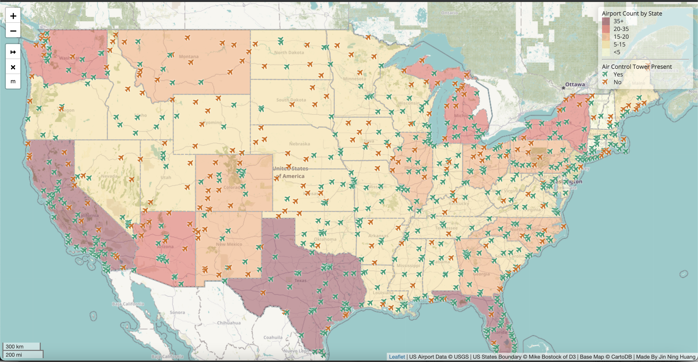

# US Airports Availability (July 2012)

### This is an assignment for UW GEOG 458 - Lab 3: Web Map Application

**This Repo contains:**
* Main html file for map display
* CSS folder 
* JS folder
* Image folder for result
* Assets folder for geoJSON data
____________________________________________________________________________________________________________________________________________________________________

## Presenting the map preview 

**Note:** This map does cover Alaska, Hawaii, and Puerto Rico. Please run the html file (by github url path) for interactive map. 

## Brief Introduction:

This interactive map will display all the detail of airport location in the United States (including Alaska, Hawaii, and Puerto Rico). This map have two ways to tell the story: to see the individual aiports and to see the total airports on each state. The data (made by USGS) was collected by July 2012, and this is for the educational purpose of learning to integrate web application with digital geography topic.   

## Functions for this Map:

* **How does this map tell stories -** One of them, you can check the individual airport (plane icon) up close on the colorful terrain map and can look up on thier name by clicking on them. You can also check if that specific airport have an air control tower or not based on the color and the legend. For the another one, you can look at each US state to see the total count of airports. You can check on the legend to the corresponding color to see the range and amount.

* **The display on the map -** I used the specific basemap as a colorful detailed terrain for those people who want to see the surrounding. The basemap include the road, river, green/forest lands that could help navigate to the airport. There is also the zoom control function (on the top-left) to see the detail in city-scale or to see the overall in world-scale. The home button is for to go back to the default display.  

## Data Sources:

* Small Scale Dataset Airports of the US - made by USGS
* US states boundaries - made by Mike Bostock of D3
* Basemap - made by Humanitarian OpenStreetMap Team

## Credits and Acknowledgment:

This lab was made by UW professor, Bo Zhao, and his team, Humanistic GIS Laboratory. I want to thanks his team for putting the effort for this educational purpose by teaching us how to do fundamental coding with digital mapping. 
